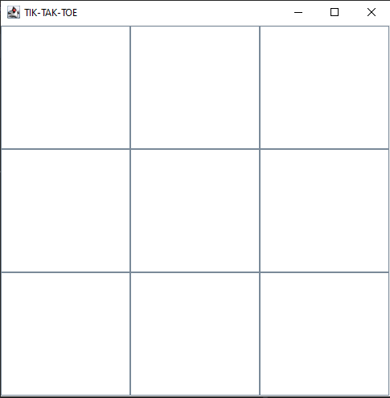
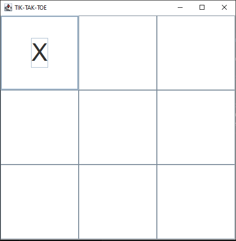
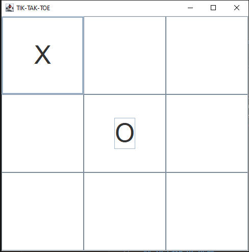
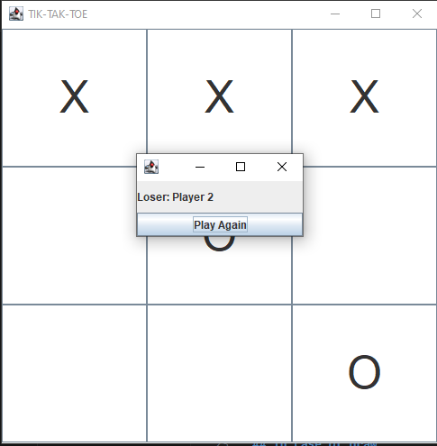
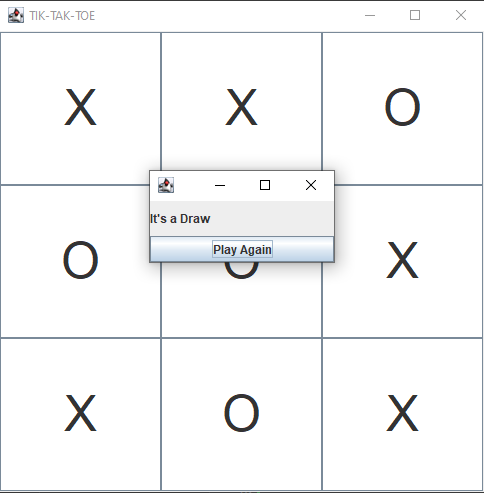

# Tik-Tak-Toe
JAVA swing implementation of the board game called tik tak toe

## ttt is short for tik tac toe

## Classes
The Driver class runs the tik tac toe game
The FinalFrame class runs a JFrame that prompts the user on playing again or exiting 
The Button class gives some formatting to the each button apart of the grid and a method controlling who's turn it is to mark (whether it is X or O)
The Grid class formats the grid adding buttons to a JFrame and it also has a method for testing for the winner and loser

# Implementation

## player 1 (X)

## play 2 (O)

## End of match

## in case of draw

